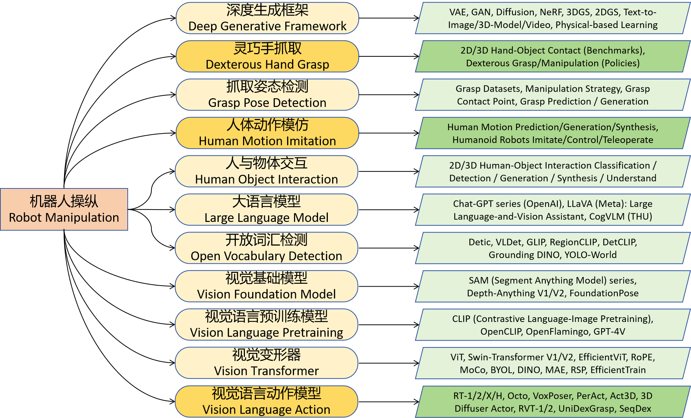

# Robot Manipulation
*also closely-related to `Artificial General Intelligence`, `Embodied Artificial Intelligence` and `Embodiment of AI`*

This is a mixed collection of many different fields including `Dexterous Hand Grasp`, `Grasp Pose Detection`, `Human Object Interaction`, `Human Motion Imitation`, `Deep Generative Framework`,  `Open Vocabulary Vision`, `Vision Foundation Model`, `Large Language Model`, `Vision Language Pretraining`, `Vision Language Action` and `Vision Transformer`. We assume that all of these fields will have a quite close and also positive impact on the final goal **Robot Manipulation** for **Embodied AGI**.

Currently, the branches frequently updated are [`Vision Language Action`](./Vision_Language_Action.md), [`Grasp Pose Detection`](./Grasp_Pose_Detection.md) and [`Dexterous Hand Grasp`](./Dexterous_Hand_Grasp.md), which are directly related to **Generalizable Robot Manipulation** in this repo.

***

